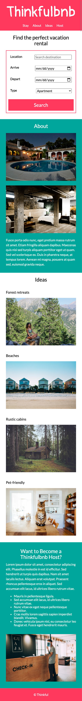

# Thinkfulbnb

Welcome to Thinkfulbnb, a static vacation rental website designed to practice HTML, CSS (including flexbox), and forms. It's not an interactive site but serves as a platform for practicing my front-end development skills. Check out the [demo](https://petrihcour.github.io/thinkfulbnb-project/)!

## Table of Contents
1. [Project Context](#project-context)
2. [Intended Use](#intended-use)
3. [Features and Aspects](#features-and-aspects)
4. [Technologies and Tools](#technologies-and-tools)
5. [Discoveries](#discoveries)
6. [Screenshots](#screenshots)
    - [Mobile View](#mobile-view)
    - [Desktop View](#desktop-view)
7. [Getting Started](#getting-started)
8. [Tasks for Practice](#tasks-for-practice)
9. [Get in Touch](#get-in-touch)

## Project Context

Thinkfulbnb is a vacation rental website that allows people to rent out their homes to those seeking short-term accommodations in various locales. Thinkfulbnb hosts offer a range of properties, including single rooms, apartments, and unique living spaces such as yachts, houseboats, yurts, tiny houses, and even renovated medieval castles. The primary purpose of this project is educational, allowing me to apply HTML and CSS concepts and create a responsive design for different devices.

## Intended Use

Thinkfulbnb is intended to be a learning tool for front-end development. It can be used by other developers as a template or practice project to improve their HTML, CSS, and responsive design skills.

## Features and Aspects

- **Purpose**: Practice and learning, with a focus on HTML and CSS, including flexbox.
- **User Experience**: Responsive design providing an optimal experience on both mobile and desktop devices.
- **Tech Stack**: HTML, CSS, and various frameworks to create a functional and visually appealing website.
- **Navigation**: Single-page navigation system for easy access to different sections.
- **Responsive Design**: Use of flexbox for layouts and media queries to adapt to mobile and desktop views.

## Technologies and Tools

- **HTML**: Structured the content and layout of the website.
- **CSS**: Styled the website, with a focus on flexbox for layout and media queries for responsiveness.
- **VSCode Live Server**: Used for local development and testing.

## Discoveries

Throughout the development of Thinkfulbnb, I discovered the importance of a mobile-first approach in responsive design, the versatility of flexbox in creating layouts, and the benefits of using mockups to guide the design process.

## Screenshots

The UX designer provided me with the following user interface mockups:

### Mobile View

### Desktop View

## Getting Started

To set up the project:
1. Clone the repository.
2. Open the project in VSCode.
3. Use the Live Server extension to launch the `index.html` page in your browser.

## Tasks for Practice

If you'd like to use this project for practice, consider completing the following tasks:

- **Mobile-First Development**: Follow a mobile-first approach in your design.
- **Navigation**: Implement a single-page navigation system.
- **HTML Form**: Create a form in the "Find your perfect vacation rental" section with specific input fields and styles.
- **Vertical Content Alignment**: Adjust content alignment for both mobile and desktop views.
- **Responsive Images**: Ensure images are responsive and match the container width.
- **Media Query**: Write a media query for screens wider than 768px to adapt the design for desktop view.

## Get in Touch

If you have any questions or want to connect with me, you can find me on [LinkedIn](https://www.linkedin.com/in/vanesssagarcia/)!